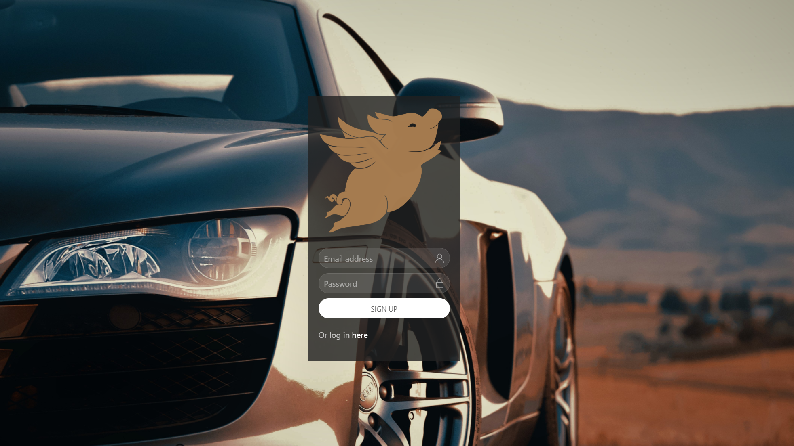

# THE-PACK's Colossal Hog Maintanence and Event Finder!

This application draws from public information to find motorcycle and car events, as well as keep track of your favorite vehicles and list of parts. There is also a page where you can search for recalls for a specific vehicle.

## Let's Get Started

[The Pack is BACK](https://the-pack-is-back.herokuapp.com/)

As a car/motorcycle enthusiast, 

## How to use THE PACK's Colossal Website!

Create an account or log-in.

## How Colossal Hog works

We used markers to open modals with relevant content. 

" width="100%" height="auto">

We added a toggle to change the background from a motorcycle to a car.

Each marker that opens a modal returns information based on Eventbrite API and VIN API information.

The second marker opens a new page that allows the user to search for car recalls. 

## Built With

* [Eventbrite](https://www.eventbrite.com/platform/api) - We used Eventbrite to find vehicle events.
* [UI Kit](https://getuikit.com/docs/introduction) - We used UIkit CSS framework. 
* [Unsplash](https://unsplash.com/t/animals) - We used copyright-free images from this site.
* [NHTSA](https://vpic.nhtsa.dot.gov/api/) - We used National Highway Traffic Safety Administration's API to information on vehicle recalls.
Our Flying Pig Icon was created by Amelia Edwards from the Noun Project.

## Contributing

Thanks to Brianna McCray, Crystal Ly, Harrison Thomas, and Joshua Kuruvilla for creating this!
Thanks to Isreal Medina, Brittany Taylor, and Eric Scott for teaching and guiding us through this bootcamp!

## Authors

* [Josh Kuruvilla](https://github.com/joshkuruvilla512)
* [Crystal Ly](https://github.com/cml2377)
* [Brianna McCray](https://github.com/bwmccray)
* [Harrison Thomas](https://github.com/hthomas93)

## License

This project is licensed under the MIT License - see the [LICENSE.md](LICENSE.md) file for details

## Acknowledgments

* Hat tip to anyone whose code was used.