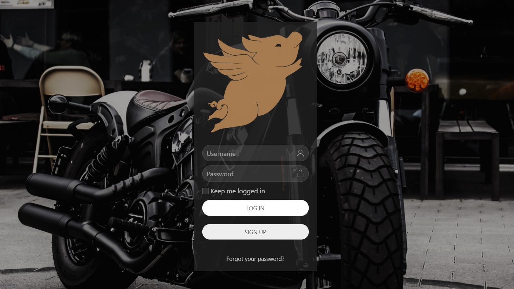

# THE-PACK's Colossal Vehicle Event Finder!

This application draws from public information to find hog and car events

## Getting Started

* [Click Here!](https://the-pack-is-back.herokuapp.com/)

User story here.

## How to use THE PACK's 

Create an account or log in using social media.

Input City OR Zip code for weather.

## How Colossal Hog works

We used placeholder. 
Please keep in mind:
 * [Outdoor Ethics](https://lnt.org/) and to 
 * [Tread Lightly!](https://www.treadlightly.org/)

## Built With

* [Google Maps](https://www.google.com/maps) - We draw from Google's API to grab locations and map area.
* [Weather](https://openweathermap.org/) - We draw from Open Weather Map to grab current and future weather of the location you select.
* [Weather Icons](https://github.com/erikflowers/weather-icons/) - We used Erik Flowers' beautiful weather icons.
* [USA Data](https://www.data.gov/) - We used US Federal govt. open data to pull public land locations.
* [Bulma](https://bulma.io/documentation/) - We used Bulma CSS framework. 
* [Unsplash](https://unsplash.com/t/animals) - We used copyright-free images from this site.
* [FontAwesome](https://fontawesome.com/) - We used the dog icon.
* [Google Fonts](https://fonts.google.com/) - We used 1 font style from Google Fonts.
* [Moment](https://momentjs.com/) - We used Moment to grab current date and forecast dates.
* [Hiking](https://www.hikingproject.com/data) - We used Hiking Project's API to grab trails based on geolocation.

## Contributing

Thanks to Brianna McCray, Crystal Ly, Harrison Thomas, and Joshua Kuruvilla for creating this!
Thanks to Isreal Medina, Brittany Taylor, and Eric Scott for teaching and guiding us through this bootcamp!

## Authors

* [Josh Kuruvilla](https://github.com/joshkuruvilla512)
* [Crystal Ly](https://github.com/cml2377)
* [Brianna McCray](https://github.com/bwmccray)
* [Harrison Thomas](https://github.com/hthomas93)

## License

This project is licensed under the MIT License - see the [LICENSE.md](LICENSE.md) file for details

## Acknowledgments

* Hat tip to anyone whose code was used.